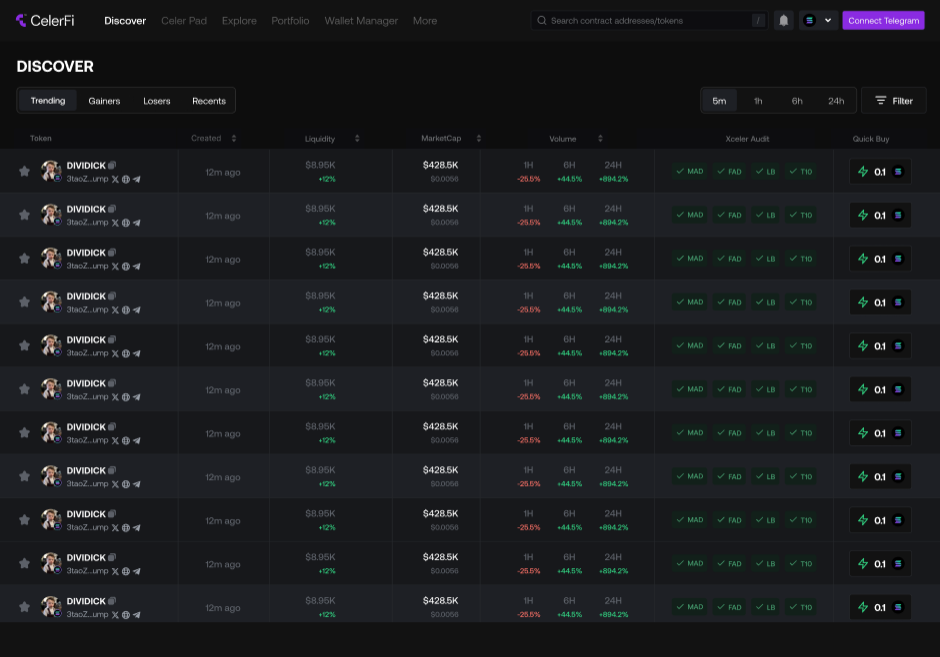

# Discover Page

> **Summary**
>
> The discover page allows you to access recent and trending tokens on the platform. You can also filter tokens to your preference.

The discover page is the first page you see when you log in to your CelerFi account. On this page, you get access to a list of trending, gaining, losing, and recently created tokens. You also get access to the profile creators or communities of each token. The discover page might look like the image below for you:

## Understanding the Discover Page
The discover page majorly consists of a table with many columns. The columns are explained in this section.

- **Token**: The token column gives you access to the names of recently created tokens and the profile of their creators or communities such as their website, X (formerly Twiter) account, Telegram, and Discord channels if available.

- **Created**: This column simply tells you the time each token was created.

- **Liquidity**: The liquidity column tells you the amount of funds available in the token's trading pool to enable buying and selling without causing significant price changes.

- **MarketCap**: This shows the market capitalization of each token. The market capitalizaion of a token is simply the measure of the total value of the token in circulation.

- **Volume**: The volume column shows you how much a specific token has been traded in the past 1, 6, and 24 hours timeframe.

- **CelerFi Audit**: The CelerFi Audit column shows you the level of trustworthiness of each token, calculated by our AI. It contains the following values:
    - **MAD (Malicious Activity Detection)**: This indicates if the token or its associated contract shows sign of malicious activities such as scam patterns.
    - **FAD (Fair Activity Detection)**: FAD tells you the level of fairness or legitimacy of the token's activities, such as avoiding pump-and-dump schemes.
    - **LB (Liquidity Boost)**: The LB tells you the status of the token's liquidity. This will let you know if there's enough liquidity for buying and selling without extreme slippage.

- **Quick Buy**: This column allows you to buy a token.
